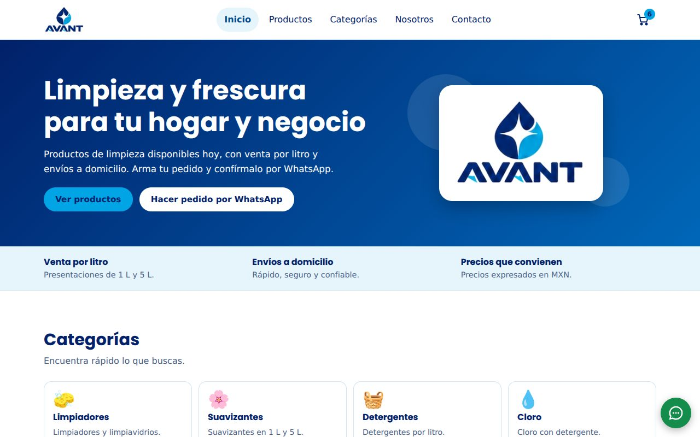
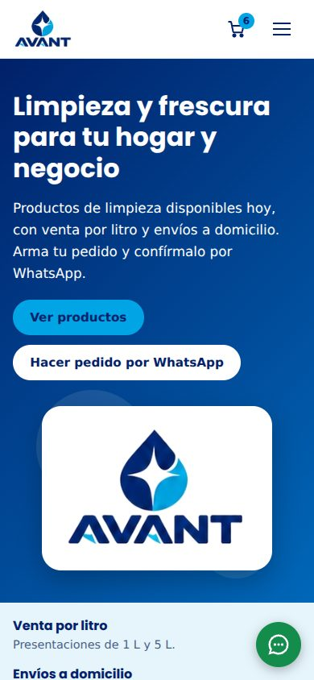
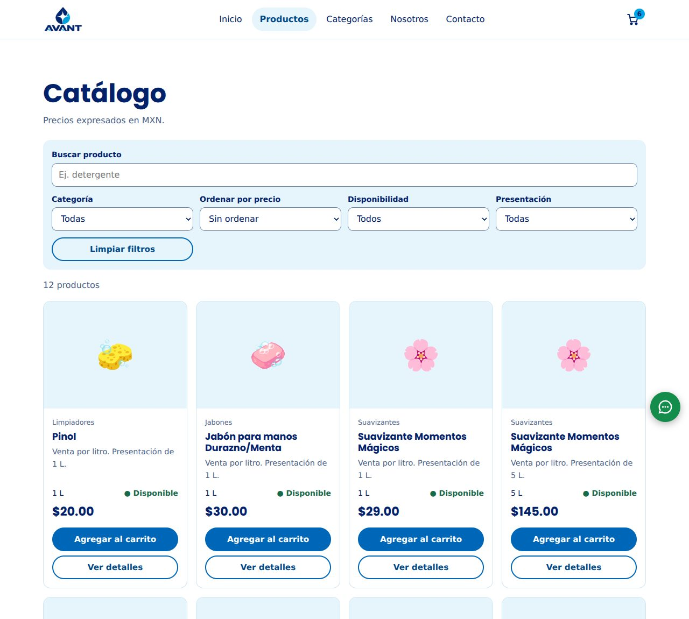
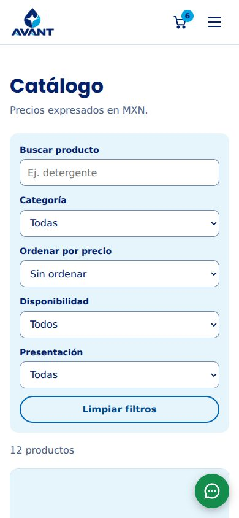
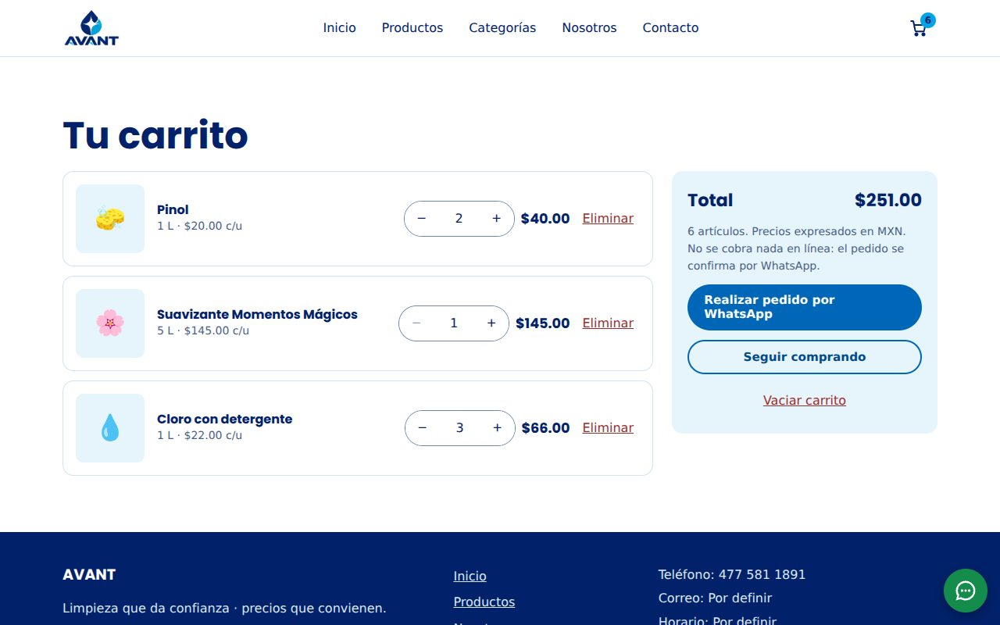
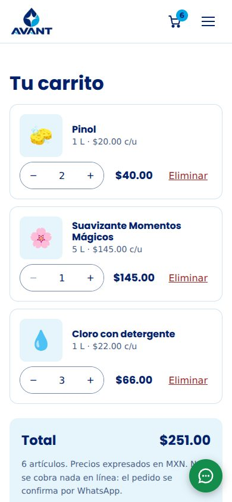

# AVANT · Tienda en línea de productos de limpieza

Sitio web de catálogo y pedidos para **AVANT**, un negocio de productos de limpieza con venta por litro.
El cliente arma su pedido en un carrito y lo **confirma por WhatsApp**: no se cobra nada en línea.

> **Sitio publicado:** _(agrega aquí el enlace cuando lo publiques; ver [docs/DEPLOY.md](docs/DEPLOY.md))_

## Capturas

<table>
  <tr>
    <td width="66%"></td>
    <td width="34%"></td>
  </tr>
  <tr>
    <td></td>
    <td></td>
  </tr>
  <tr>
    <td></td>
    <td></td>
  </tr>
</table>

## Funcionalidades

- **Catálogo** con búsqueda (ignora mayúsculas y acentos), filtros por categoría, disponibilidad y presentación, y orden por precio. Los filtros se guardan en la dirección, así se pueden compartir.
- **Detalle de producto** con precio, presentación, disponibilidad y cantidad.
- **Carrito** que se conserva al cerrar el navegador, con cantidades limitadas a las existencias.
- **Pedido por WhatsApp**: genera automáticamente el mensaje con productos, cantidades y total.
- **Botón flotante de WhatsApp** en todas las páginas.
- **Ofertas y paquetes** (etiqueta de oferta, precio anterior tachado, paquetes con precio fijo). Están desactivados hasta que el negocio defina sus promociones.
- Páginas de **Nosotros**, **Contacto** y **404**.
- **Diseño responsive** (celular primero) y **accesible**: navegación con teclado, foco visible, etiquetas para lectores de pantalla y contraste verificado.
- **SEO básico**: títulos y descripciones por página, Open Graph, títulos dinámicos por producto y categoría.
- **Listo para conectar un servidor** (API): ver [docs/ARQUITECTURA.md](docs/ARQUITECTURA.md).

## Tecnologías

HTML5, CSS3 y JavaScript sin frameworks ni librerías (menos de 60 KB de JS y CSS en total).
Tipografías Poppins e Inter desde Google Fonts. Publicación gratuita con GitHub Pages.

## Estructura del proyecto

```text
.
├── index.html              Inicio
├── 404.html                Página "no encontrada"
├── pages/                  productos, producto (detalle), carrito, ofertas, nosotros, contacto
├── css/
│   ├── style.css           Estilos base (diseño para celular) y variables de color
│   └── responsive.css      Ajustes para tablet y computadora
├── js/
│   ├── config.js           Datos del negocio, WhatsApp y opciones (el archivo que más se edita)
│   ├── products.js         Categorías y productos
│   ├── offers.js           Ofertas y paquetes
│   ├── api.js              Capa de datos (local hoy; servidor en el futuro)
│   ├── cart.js             Lógica del carrito
│   ├── whatsapp.js         Enlaces y mensaje del pedido
│   ├── ui.js               Header, footer, tarjetas y avisos compartidos
│   ├── filters.js          Búsqueda, filtros y orden
│   └── app.js, catalog.js, detail.js, cart-page.js,
│       offers-page.js, about.js, contact.js    Código de cada página
├── images/                 Logo, ícono y (a futuro) fotos de productos
├── admin/                  Reservada para el futuro panel administrativo
└── docs/                   Guías, arquitectura, esquema de base de datos y capturas
```

## Cómo ejecutarlo en tu computadora

No requiere instalar nada: descarga el proyecto y abre `index.html` en el navegador.

Para una prueba más fiel a la publicación real (recomendado), sírvelo con un servidor local:

```bash
python -m http.server 8000     # y abre http://localhost:8000
```

o usa la extensión **Live Server** de VS Code.

## Configuración

| Qué quieres cambiar | Dónde |
| --- | --- |
| Número de WhatsApp, teléfono, correo, horario, ubicación, redes | `js/config.js` |
| Texto de "Nosotros" y nombre/logo del negocio | `js/config.js` y `images/` |
| Productos, precios, existencias y fotos | `js/products.js` |
| Ofertas y paquetes (y mostrarlos en el menú) | `js/offers.js` y `SHOW_PROMOTIONS` en `js/config.js` |
| Colores | Variables al inicio de `css/style.css` |

Cuando publiques cambios, sube el número `?v=` de los enlaces a CSS y JS en los HTML para que los
visitantes reciban los archivos nuevos (ver [docs/DEPLOY.md](docs/DEPLOY.md)).

## Publicación

Guía paso a paso para publicarlo gratis con GitHub Pages: **[docs/DEPLOY.md](docs/DEPLOY.md)**.

## Calidad

Verificado con pruebas automáticas (lógica del carrito, mensaje de WhatsApp y capa de datos contra
una API simulada) y con un navegador automatizado: auditoría de accesibilidad **axe-core sin
problemas** en 10 vistas (celular y computadora), sin desbordes horizontales entre 320 y 1440 px y
sin errores de JavaScript. No sustituye las pruebas en dispositivos reales.

## Próximas funcionalidades

- Servidor y base de datos ([esquema propuesto](docs/schema.sql)).
- Panel administrativo para productos, precios, inventario y promociones.
- Pedidos guardados y seguimiento de estado.
- Fotos reales de productos y URLs amigables para mejorar el posicionamiento.
- Precios de mayoreo y pagos en línea (opcional).

Detalle y orden sugerido en [docs/ARQUITECTURA.md](docs/ARQUITECTURA.md).

## Datos y licencia

Los productos y precios provienen de la lista de precios de AVANT y pueden cambiar sin previo aviso.
El logo y el nombre pertenecen a su titular. **Licencia: pendiente de definir por el titular del proyecto.**
