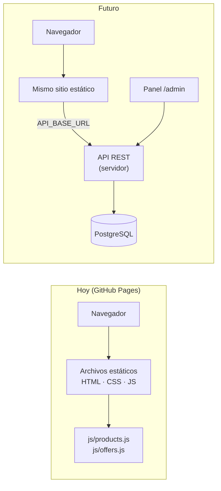

# Arquitectura y plan de crecimiento

Este documento explica cómo está organizado el sitio hoy y cómo puede conectarse, más adelante, a un
servidor con base de datos y un panel administrativo **sin rehacerlo**. Nada de lo descrito como "futuro"
está desarrollado todavía.

## 1. Situación actual y futura



Hoy los datos viven en `js/products.js` y el pedido termina en WhatsApp. En el futuro los datos
vendrán de una API y el negocio los editará desde un panel, en lugar de editar archivos.

## 2. Cómo está organizado el código

| Capa | Archivos | Responsabilidad |
| --- | --- | --- |
| Configuración | `config.js` | Datos del negocio, WhatsApp, opciones y `API_BASE_URL` |
| Datos | `products.js`, `offers.js`, `api.js` | De dónde salen categorías, productos y paquetes |
| Lógica | `cart.js`, `filters.js`, `whatsapp.js` | Carrito, búsqueda/filtros y mensaje del pedido (no tocan el HTML) |
| Presentación | `ui.js` y un archivo por página | Dibujan el HTML con esos datos |

Regla clave: **la lógica no depende de dónde vienen los datos**. Por eso cambiar de datos locales a una
API solo afecta a `api.js`.

## 3. Punto de conexión con el servidor

En `js/config.js`, `API_BASE_URL` está vacío (modo local). Al escribir una dirección, `api.js` pide al
servidor `/categories`, `/products` y `/packages`, reemplaza los datos locales y el sitio funciona igual.
Mientras carga muestra "Cargando productos…", y si el servidor falla muestra un aviso sin romper la página.
Esto se probó contra un servidor simulado.

### Formato de los datos que debe devolver la API

```json
// GET /categories
[{ "id": "limpiadores", "name": "Limpiadores", "icon": "🧽", "description": "Limpiadores y limpiavidrios." }]

// GET /products
[{ "id": 1, "name": "Pinol", "category": "limpiadores", "price": 20, "presentation": "1 L",
   "image": "images/products/pinol-1l.jpg", "description": "Venta por litro.", "stock": 99,
   "onSale": false, "discountPrice": null }]

// GET /packages
[{ "id": "basico", "name": "Paquete básico", "icon": "📦", "price": 99, "description": "Lo esencial.",
   "items": [{ "id": 1, "qty": 1 }, { "id": 3, "qty": 1 }] }]
```

Reglas que el frontend espera (si no se cumplen, el carrito falla):

- El `id` de un **producto es un número**; el `id` de un **paquete es un texto no numérico** ("basico"). El carrito
  distingue producto de paquete por ese tipo. La `category` de un producto es el `id` (texto) de su categoría.
- `price` y `discountPrice` son números en pesos. `stock` es un entero (0 = agotado).
- `onSale: true` solo cuenta si `discountPrice` es menor que `price`.
- `image` puede ir vacío; entonces se muestra el icono de la categoría.

## 4. Endpoints propuestos

**Públicos (sin inicio de sesión)**

| Método | Ruta | Uso |
| --- | --- | --- |
| GET | `/categories` | Lista de categorías activas |
| GET | `/products` | Productos activos con existencias (admite `?category=`) |
| GET | `/products/:id` | Un producto |
| GET | `/packages` | Paquetes activos |
| POST | `/orders` | Registrar un pedido (el servidor recalcula precios y verifica existencias) |

**Administración (requieren inicio de sesión y rol)**

| Método | Ruta | Uso |
| --- | --- | --- |
| POST | `/admin/login` · `/admin/logout` | Sesión |
| GET · POST · PATCH | `/admin/products` · `/admin/products/:id` | Alta, edición, precio, foto, ocultar |
| PATCH | `/admin/inventory/:productId` | Ajustar existencias (queda registrado) |
| GET · POST · PATCH | `/admin/categories`, `/admin/packages`, `/admin/promotions` | Catálogo y promociones |
| GET · PATCH | `/admin/orders` · `/admin/orders/:id` | Ver pedidos y cambiar su estado |
| GET | `/admin/customers` | Clientes |
| GET · POST · PATCH | `/admin/users` | Usuarios y roles (solo administrador) |

## 5. Modelo de datos

Diseño propuesto en [`schema.sql`](schema.sql) (PostgreSQL, 12 tablas): categorías, productos, inventario y
movimientos, paquetes, promociones, clientes, pedidos con sus partidas y usuarios del panel. Se validó su
sintaxis con un analizador de PostgreSQL, pero **no se ha ejecutado contra una base de datos real**.
Decisiones importantes:

- Precios con `numeric(10,2)`, nunca decimales de punto flotante.
- Cada partida de un pedido guarda una **copia del nombre y precio** al comprar.
- Los productos se **desactivan**, no se borran, para no perder el historial de pedidos.
- Las contraseñas se guardan solo como **hash**.

## 6. Panel administrativo (`/admin`)

Módulos previstos: productos (precio, foto, ocultar), categorías, inventario, paquetes y promociones,
pedidos y clientes, usuarios y roles (administrador / personal). Ver [`../admin/README.md`](../admin/README.md).

> **Importante:** GitHub Pages solo sirve archivos y **no puede proteger una página con contraseña**.
> El panel debe vivir en un servidor con inicio de sesión real; una "contraseña" escrita en JavaScript
> la vería cualquiera.

## 7. Seguridad (checklist para cuando exista el servidor)

- Todo por **HTTPS**.
- Contraseñas con **bcrypt o argon2**; nunca en texto ni en el frontend.
- Sesiones con cookies `HttpOnly`, o tokens con caducidad corta.
- **CORS** limitado a la dirección del sitio.
- **Validar todo en el servidor**; consultas parametrizadas (contra inyección SQL).
- **No confiar en el navegador**: el servidor recalcula precios y verifica existencias en cada pedido.
- Límite de intentos en el inicio de sesión y en `POST /orders`.
- Claves y contraseñas en **variables de entorno** (`.env` ya está en `.gitignore`); nunca en el repositorio.
- Respaldos periódicos de la base de datos y registro de quién cambia precios.

## 8. Ruta sugerida por fases

1. **Hoy:** sitio estático publicado (GitHub Pages).
2. **Base de datos y API de solo lectura:** crear tablas, cargar los productos actuales, exponer `/categories`, `/products`, `/packages` y poner la dirección en `API_BASE_URL`.
3. **Panel con inicio de sesión:** alta y edición de productos, precios y existencias (deja de editarse `products.js`).
4. **Pedidos guardados:** `POST /orders` además del mensaje de WhatsApp, con estados.
5. **Inventario con movimientos, promociones, clientes y reportes.**
6. **Opcional:** pagos en línea, precios de mayoreo, y generar páginas por producto para SEO.

## 9. Limitaciones conocidas del sitio estático

- Los productos se dibujan con JavaScript: los buscadores y las vistas previas al compartir por redes no ven el
  detalle de cada producto. Se resuelve más adelante generando páginas por producto desde el servidor o al publicar.
- Las direcciones amigables (`/detergentes`) necesitan servidor o generación previa; hoy se usa
  `productos.html?categoria=detergentes`.
- Las existencias y los precios visibles son los del archivo publicado; no hay control en tiempo real hasta tener servidor.
- El stock de un paquete y el de sus productos sueltos se calculan por separado.
